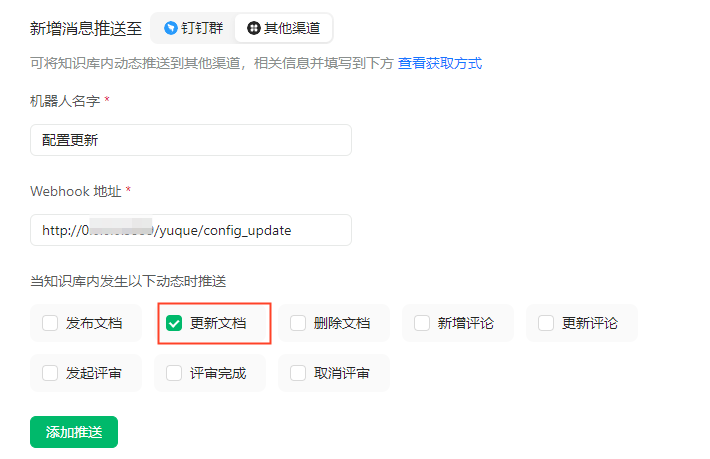
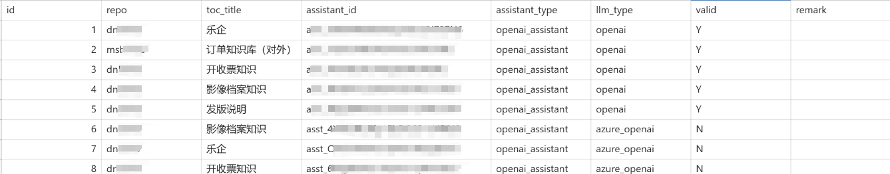
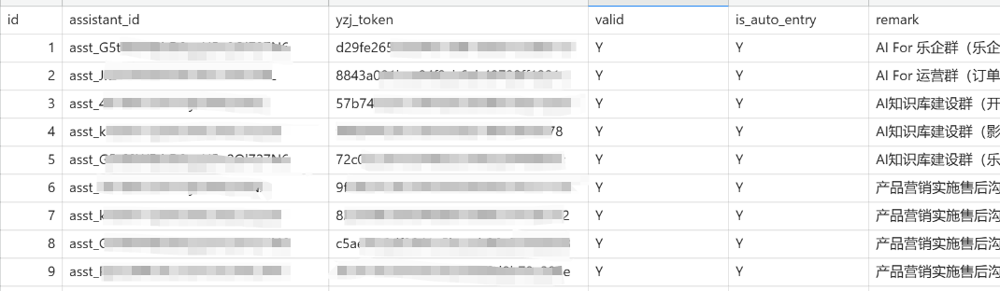

# 知识库集成中心

## 1. 项目介绍

本项目用于将发票云内部的语雀知识与LLM、IM、金蝶社区等系统打通，具体流程如下：


- 流程的核心是知识集成中心，它负责串联知识的来源地和知识输出地、串联IM的问题和AI模型的回答
- 流程有三类：数据同步、问答或搜索、逆向反馈三类流程
  - 数据同步：由知识库后台定时从语雀同步到指定的地方；语雀内容由知识库负责人进行维护
  - 问答、搜索：用户可通过云之家或其他IM的进行问答；也可以直接到各知识库进行搜索
  - 逆向反馈：知识集成中心将无法回答的问题自动录入指定FAQ地址，后续由知识库负责人进行处理
  
  
  
  已完成：
  
  > 1. 云之家群聊的正向流程
  > 2. 语雀文档的定时同步
  > 3. 问答自动录入指定FAQ文档地址

## 2. 配置
### 2.1 云之家群配置
- 在群中启用一个“通知”机器人，获取yzjtoken
- 在该群启用一个“对话型”机器人，将项目地址填入其接受地址，并将上面token填入，例如：{项目运行地址}/yzj/chat?yzj_token=***
### 2.2 语雀、云之家群、GPT Assistant的关系配置

1、在配置文件所在的语雀知识库中配置消息推送,webhook地址为 {项目运行地址}/yuque/config_update



2、在语雀上配置助手信息（语雀知识库和GPT Assistant的关系）、云之家信息（云之家群和GPT Assistant的关系）以及智齿信息（智齿和GPT Assistant的关系），后续新增新通道可继续增加配置：

可修改config/settings.py的CONFIG_INFO指定配置文档

配置文档格式如下：

**助手配置**



**云之家配置**



**智齿配置**


4、在.env中配置相关key

```editorconfig
# openai
OPENAI_API_KEY=sk-***

# azure
AZURE_OPENAI_API_KEY=***
AZURE_OPENAI_ENDPOINT="https://kdtest.openai.azure.com/"
...
```

安装依赖

1. 安装mysql

- 执行sql.txt中的语句建立表格

2. 安装python环境

```shell
conda create -n llm python=3.10
pip install -r requirements.txt -i https://pypi.tuna.tsinghua.edu.cn/simple
```

启动服务

```shell
python src/app.py
```

> 环境要求：python3.10+
